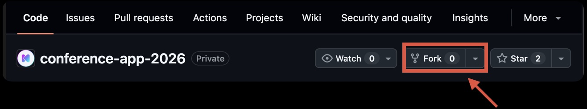
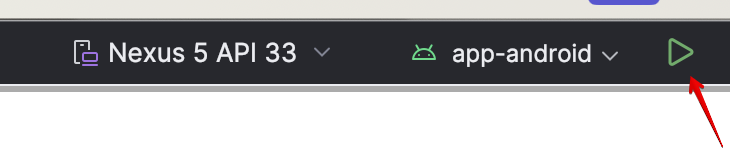

# Contributing

We welcome your contributions!

## Step-by-Step Guide to Contributing

### 1. Download the Source Code

First, download the repository locally and try out the app. This will help you understand how the app works and its features.
Click the `Fork` button at the top right of the repository. This will create a copy of the repository in your account.



Then, run the following command:

```bash
git clone https://github.com/[your-account]/conference-app-2026
```

This will download the repository to your PC.

### 2. Run the App

Open Android Studio and select "Open" to open the downloaded repository. You can download Android Studio from [here](https://developer.android.com/studio). Please use the latest version.

When you open the repository, the sync will start. Please wait for the Gradle sync to complete.

Build and run the `app-android` module. Click the run button in Android Studio.



### 3. Find a Task

We use GitHub Issues for task management. Please look for an Issue you'd like to contribute to. [Issues labeled `contributions welcome` or `easy`](https://github.com/DroidKaigi/conference-app-2026/issues?q=is%3Aissue+is%3Aopen+label%3A%22difficulty%3Aeasy+%F0%9F%8C%B1%22+label%3A%22contributions+welcome%22+) are recommended for first-time contributors.

Pull Requests without an Issue are also welcome. In that case, please include details such as the reason, cause, and solution in your Pull Request.

### 4. Start Contributing

If you've found a task you'd like to work on, please comment on the Issue with ":raising_hand:" or similar to avoid duplicate work. We will then assign the Issue to you.
We'll try to respond to your comment as soon as possible, but feel free to start working on the task after commenting on the Issue!

From this year, we assign one Issue to each contributor at a time, so that as many people as possible have a chance to take part in open source. Once your Issue is closed, you are very welcome to pick up the next one.

If an Issue assigned to you stays quiet for a while, we may release the assignment so that someone else can pick it up. We aim to leave a comment on the Issue before doing so. Commenting on the Issue keeps the assignment with you, and so does having an open Pull Request linked to it — a draft is fine too.

You are always welcome to come back — just comment on the Issue again whenever you are ready to continue, and let us know at any time if you need more time or run into something you are stuck on.

### 5. Develop

Make changes to the app's code and start developing!

If you want to learn about Jetpack Compose, the UI toolkit we're using this year, you might find the following helpful:
https://developer.android.com/courses/jetpack-compose/course

The command for code formatting is as follows. You can run it by opening this document in Android Studio and clicking the run button on the left:

```bash
./gradlew spotlessApply
```

### 6. Create a Pull Request

Once you've completed your changes, please create a pull request.
Commit and push your git changes, then create a pull request from the GitHub UI (https://github.com/[your-account]/conference-app-2026).

We use English for Issues, comments, and reviews.

If possible, please use English, but Japanese is also fine.
Please note that we only support English and Japanese in this repository.
※For your reference, the DroidKaigi organizing team consists of both Japanese and English speakers.

To non-native English speakers, not all DroidKaigi organizers are proficient in English either. Don't be afraid to try communicating in English! :smile:

### 7. Code Review and Merge

Once you've created your pull request, the code review process will begin. If we need to request changes, we'll add inline comments to the diff, so please check them as needed. Once the changes are complete, your pull request will be merged. 👍

## How to Discuss and Propose

While Issues are preferred, if you have specific ideas for implementation or refactoring, Pull Requests are also welcome.

## NOTE

If you have any questions, please don't hesitate to ask!

Enjoy contributing, learn a lot, share knowledge, and have fun at DroidKaigi!
