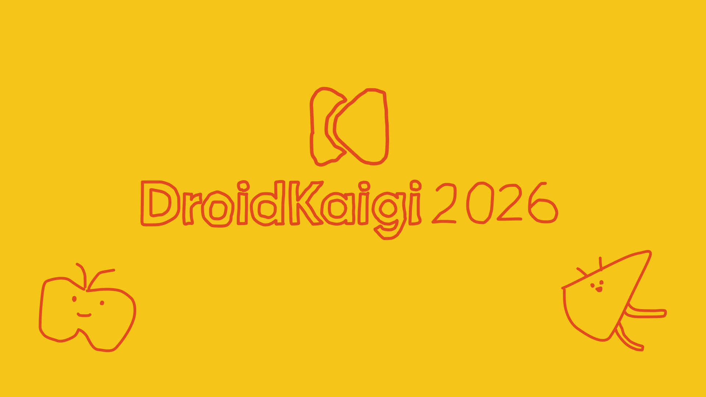

# DroidKaigi 2026 official app

[DroidKaigi](https://2026.droidkaigi.jp) is a conference for Android developers, now in its
twelfth year. It runs for three days, 1–3 September 2026, at Bellesalle Shibuya Garden in Tokyo.

The official app is built in the open by the community that attends it — a Compose Multiplatform
app for **Android / iOS / Desktop (JVM) / Web (wasmJs)**. Anyone is welcome to help build it —
see [Contributing](#contributing).

## Features

The DroidKaigi 2026 official app offers a variety of features to enhance your conference
experience:

- **Timetable**: Browse the schedule and bookmark the sessions you want to see.
- **Event map**: Find your way around the venue.
- **Contributors**: Discover the contributors behind the app.

...and more!

## Contributing

We welcome contributions.

For a step-by-step guide, see [CONTRIBUTING.md](CONTRIBUTING.md). It walks you through everything
from setting up your environment to submitting a pull request.

コントリビューションの詳細な手順については [CONTRIBUTING.ja.md](CONTRIBUTING.ja.md) をご覧ください。
初めての方でもわかりやすいステップバイステップのガイドを用意しています。

> [!NOTE]
> **Issue assignment rules changed this year.** To give as many people as possible a chance to take
> part, each contributor holds **one open Issue at a time** — finish the one you have before
> picking up the next. An assigned Issue with no activity receives a reminder, and is unassigned
> automatically if it stays quiet after that. A comment, or an open pull request linked to
> the Issue (a draft counts), keeps it yours, and you are welcome to pick it up again at any time.
>
> **今年からIssueのアサイン運用が変わりました。**
> より多くの方に参加していただけるよう、一人が同時に持てるIssueは**1件まで**としています。
> 次のIssueに取りかかる前に、いま持っているものを完了させてください。
> アサインされたIssueに動きがない場合はリマインドのコメントが入り、その後も動きがなければ自動的にアサインが解除されます。
> Issueへのコメント、または紐づいたオープンなPull Request（ドラフトでも構いません）があれば、アサインは維持されます。
> 解除されたあとも、いつでも再度お引き受けいただけます。

## Design

TBD

**Designers**: [@kitakkun](https://github.com/kitakkun), [@chihokotaro](https://x.com/chihokotaro)

## This Year's Challenges

The stack underneath: Compose Multiplatform for the shared UI,
[Metro](https://github.com/ZacSweers/metro) for compile-time dependency injection,
[Soil](https://github.com/soil-kt/soil) for the data layer, and Navigation3 for moving between
screens.

### An architecture the compiler keeps in shape

This year's codebase is written on the premise that **AI is a primary author**. Rather than
relying on review to catch a bug or a drifting convention, the architecture is shaped so that
**anything outside the intended shape fails to compile**.

Enforcement is applied in a fixed order of preference:

1. **Make illegal states unrepresentable through types.** Context parameters and typed receivers
   deliberately narrow where a declaration can be called from, so a call made in the wrong place
   does not resolve. This layer needs no tooling and survives compiler upgrades untouched.
2. **A checker in the Kotlin compiler frontend (FIR)**, for the binary rules that types cannot
   express.
3. **Review and tests**, for what cannot be decided statically.

`:tools:compiler-plugin` implements over twenty FIR checkers on that second layer. They cover API
misuse that would otherwise surface only at runtime, the boundaries between the parts of a screen,
and the conventions that keep code readable. Each one is a compile error — a few examples:

```kotlin
data class SearchResponse(…)   // no @Serializable

buildPersistedQueryKey(          // this key caches its response on disk
    fetchResponse = { searchResponse },
    …
)
// ERROR: MustBeSerializable — persistence would fail at runtime
```

```kotlin
// TimetableCard.kt — no @Preview in this file renders it
@Composable
internal fun TimetableCard(item: TimetableItem) { … }
// ERROR: UiComponentRequiresPreview
```

```kotlin
Scaffold { padding ->                     // 1
    Column(Modifier.padding(padding)) {   // 2
        LazyColumn {                      // 3
            items(sessions) { item ->     // 4
                Card {                    // ERROR: 5
                    Text(item.title)
                }
            }
        }
    }
}
// ComposableNestingDepth — move level 5 into its own composable
```

Every checker is covered by the Kotlin compiler test framework, so the rules themselves are
tested like any other code. The full map is in [Enforcement](./docs/enforcement.md).

On top of the guardrails, `scripts/new-screen.sh` generates every file a new screen needs across
modules; the generated code compiles on all four targets and passes every checker. See
[AI-assisted development](./docs/ai-development.md).

### A structure that keeps changes apart

An AI author changes code quickly, and often in several places at once. Two kinds of measure keep
those changes from landing on the same lines.

**Nothing central to edit.** Where another codebase would keep a registry every feature has to
append to, this one aggregates instead. Each feature contributes its own navigation entries
through `@ContributesIntoSet` and Metro merges them; the serializer registration those entries
need is generated by Kotlin Symbol Processing (KSP) the same way. Adding a screen adds files
rather than touching them. Features
cannot reach each other either — cross-feature isolation is a Gradle module boundary rather than
a convention.

**UI that cannot grow into one large file.** Two checkers keep feature UI split up:
`ComposableNestingDepth` caps content lambdas at four levels, so a fifth level has to become its
own composable, and `ScreenIsSoleComponentInFile` then gives that composable a file of its own.
Two edits to two components end up as edits to two files.

### A fourth platform

Web (wasmJs) joins Android, iOS, and desktop JVM this year, and all four run the same Compose
Multiplatform UI from `commonMain`. Each platform owns only a small terminal module that builds
the Metro dependency graph and launches the shared `KaigiApp`. See
[Platforms & modules](./docs/platforms-and-modules.md).

Navigation3 now supports every target the app ships to, so it owns the back stack on all four —
last year iOS had to fall back to `navigation-compose`. See [Navigation](./docs/navigation.md).

### Roles carried by context parameters

Each screen is a Root / Presenter / Screen triad, and a bidirectional `ScreenChannel` carries an
`Action` from the Root to the Presenter and an `ActionResult` back. Each end of that channel is
reachable only with the matching context parameter in scope, so touching the wrong end from the
wrong layer is a compile error rather than a convention. See
[Architecture overview](./docs/architecture-overview.md).

### Offline-first by default

Soil's queries persist the raw server response and restore it on launch, so a screen renders from
cache before the network answers. The persisted type must be `@Serializable`, checked at compile
time rather than at the moment persistence first runs. See
[Soil persistence](./docs/soil-persistence.md).

### iOS: Compose Multiplatform, with one native exception

Every screen on iOS is drawn by Compose Multiplatform. The single native piece is the root tab
bar, a SwiftUI `TabView` rendering the Liquid Glass design over the Compose backdrop. The Swift
side stays deliberately small, talking to Kotlin through Swift Export and reaching Apple
frameworks through Swift Package Import. See [iOS overview](./docs/ios.md).

## Requirements

- **Android Studio**: the latest stable release, from [this page](https://developer.android.com/studio).
- **JDK 21** or higher.
- **Xcode**, to build and run the iOS app.

Gradle comes from the wrapper, so there is nothing else to install.

## Running the app

```sh
# Android
./gradlew :app-android:installDevDebug

# Desktop (JVM)
./gradlew :app-desktop:run

# Web (wasmJs)
./gradlew :app-web:wasmJsBrowserDevelopmentRun
```

iOS builds through the Xcode project in `app-ios/`, which embeds the `app-shared` framework.

## Documentation

The architecture and implementation guide is published at
**[droidkaigi.github.io/conference-app-2026/docs](https://droidkaigi.github.io/conference-app-2026/docs/)**.
Start with [Module structure](https://droidkaigi.github.io/conference-app-2026/docs/project-structure)
and the [Architecture overview](https://droidkaigi.github.io/conference-app-2026/docs/architecture-overview).

The pages live in [`docs/`](./docs/index.md) and are built with VitePress. To preview a change locally:

```sh
cd docs-site
npm install   # first time only
npm run docs:dev
```

## Verification

Compile all four targets and run the `:feature:sessions` tests:

```sh
./gradlew :app-desktop:compileKotlinJvm :app-web:compileKotlinWasmJs :app-android:compileDevDebugKotlin :app-shared:linkDebugFrameworkIosSimulatorArm64 :feature:sessions:jvmTest
```
