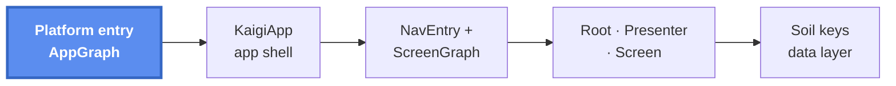
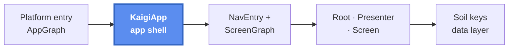
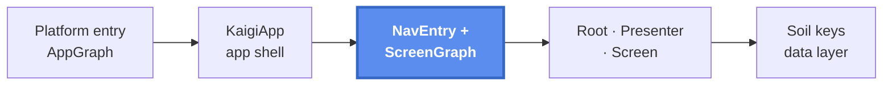
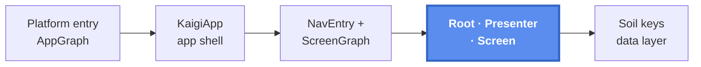
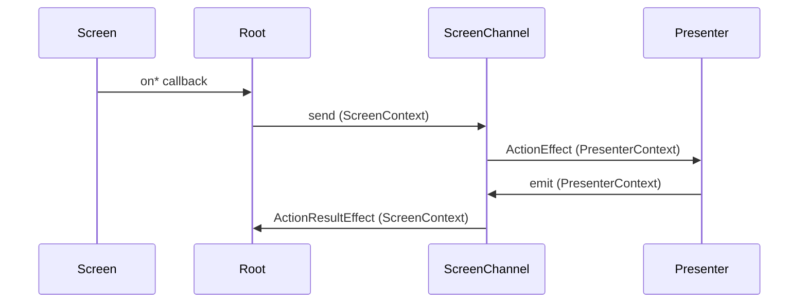
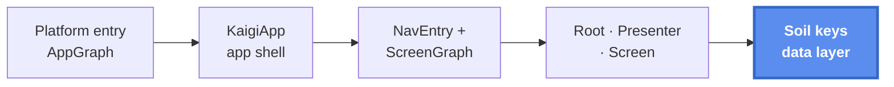

# Architecture overview

This page follows one request end to end — from the platform entry point, through dependency injection, navigation, and the data layer, to a rendered, interactive feature screen. Read it top to bottom to see how the pieces fit; every layer links to the page that owns its details.

The core stack: Compose Multiplatform for shared UI across all four platforms (Android / desktop JVM / iOS / Web), a composable Presenter for UI state, [Soil](./soil-keys.md) for the data layer with persist-by-default caching, [Metro](./di-app-graph.md) for compile-time dependency injection, and [Navigation3](./navigation.md) for the back stack on every platform. The one native exception is the iOS [Liquid Glass navigation bar](./ios-liquid-glass.md).

The same overall picture repeats at the start of each section, with the part that section covers highlighted.

## 1. Platform entry — realizing the AppGraph



Each platform owns a terminal module that realizes the `AppGraph` contract and launches `KaigiApp`. `AppGraph` is a plain interface declared in `app-shared`; each platform realizes it as a Metro `@DependencyGraph` scoped to `AppScope` — `AndroidAppGraph`, `DesktopAppGraph`, `WebAppGraph`, and `IosAppGraph`. The graph must sit at or below `app-shared` because a Metro graph aggregates only the `@Contributes*` bindings on its own compile classpath, and only there is every feature and core module visible.

On Android, the `Application` builds the graph once (handing in the `Context` through a graph factory) and the `Activity` opens it around `KaigiApp`:

```kotlin
class KaigiApplication : Application() {
    val appGraph: AppGraph by lazy {
        createGraphFactory<AndroidAppGraph.Factory>().create(applicationContext)
    }
}

class MainActivity : ComponentActivity() {
    override fun onCreate(savedInstanceState: Bundle?) {
        super.onCreate(savedInstanceState)
        setContent {
            context(appGraph) {
                KaigiApp(backStack = rememberKaigiBackStack())
            }
        }
    }
}
```

The other platforms repeat the same two steps in their own entry points — desktop and web call `createGraph<…>()` in `main`, and iOS wraps the same `KaigiApp` call in a `UIViewController`. `KaigiApp` depends only on the `AppGraph` interface, so the shared UI never learns which platform realized it. See [iOS](./ios.md) and [AppGraph](./di-app-graph.md).

## 2. KaigiApp — the shared shell



`KaigiApp` is the layer that provides the app-global environment every screen assumes — the Soil client, the theme, and a set of per-entry services — and drives navigation over a single back stack:

```kotlin
context(appGraph: AppGraph)
@Composable
fun KaigiApp(backStack: NavBackStack<NavKey>) {
    SwrClientProvider(appGraph.swrClient) {      // Soil client, available to every screen
        KaigiTheme(colorScheme = …) {            // color scheme subscribed via Soil
            NavigatorEffect(…)                   // AppNavigator commands → back stack
            NavDisplay(
                backStack = backStack,
                entryDecorators = …,             // per-entry: saveable state, retain store,
                                                 //   snackbar host, safe-click debounce
                sceneStrategies = …,             // root / list-detail / single pane
            )
        }
    }
}
```

The entry decorators are what make per-screen services feel ambient: each entry gets its own retained store (screen graphs survive transient destruction), its own `SnackbarHostState`, and debounced click dispatch, all exposed through CompositionLocals. For the scene, decorator, and predictive-back mechanics in detail, see the [navigation pages](./navigation.md).

## 3. Reaching a screen



`NavDisplay` renders whatever `NavKey` sits on top of the back stack. It resolves that key through `appGraph.appEntryProvider.entryProvider`, an aggregated function built from a `Set<NavEntryProvider>`. Each feature contributes its own `NavEntryProvider` with `@ContributesIntoSet(AppScope::class)`, and `AppEntryProvider` merges them in `app-shared` — no central registry is edited when a screen is added. See [entry aggregation](./navigation-entry-aggregation.md).

A feature's provider looks like this (code on this page is simplified for reading — exact signatures live in the linked pages):

```kotlin
@ContributesIntoSet(AppScope::class)
@Inject
class TimetableNavEntryProvider(
    private val screenGraphFactory: TimetableScreenGraph.Factory,
) : NavEntryProvider {
    override fun EntryProviderScope<NavKey>.register() {
        entry<TimetableNavKey> {
            // the per-screen graph survives transient destruction of the entry
            val graph = retain(screenGraphFactory::createTimetableScreenGraph)
            context(graph.screenContext) {
                TimetableScreenRoot(
                    onNavigateToDetail = graph.screenNavigator::openSessionDetail,
                )
            }
        }
    }
}
```

The retained graph is a Metro `@GraphExtension` that exposes the screen's `ScreenContext`, and the entry opens that context around the Root. See [per-screen graph](./di-screen-graph.md) and [ScreenContext](./screen-context.md).

## 4. Inside a screen



Each screen is a Root / Presenter / Screen triad. The Root shows the whole shape:

```kotlin
context(screenContext: TimetableScreenContext)
@Composable
fun TimetableScreenRoot(onNavigateToDetail: (TimetableItemId) -> Unit) {
    SoilDataBoundary(                       // loading & error handled here
        state1 = rememberQuery(screenContext.timetableQueryKey),
    ) { timetable ->
        val screenChannel = retainScreenChannel<Action, ActionResult>()

        ActionResultEffect(screenChannel) { result ->
            // presenter-originated one-offs: show a snackbar, navigate, …
        }

        val uiState = context(screenContext.presenterContext) {
            timetableScreenPresenter(screenChannel, timetable)
        }

        TimetableScreen(
            uiState = uiState,
            onBookmarkClick = { screenChannel.send(Action.Bookmark(it)) }, // real work → presenter
            onItemClick = onNavigateToDetail,                              // navigation-only → straight through
        )
    }
}
```

- **Presenter** runs in the `PresenterContext` scope: it reads Soil keys, shapes an immutable `UiState`, consumes actions through `ActionEffect`, and drives mutations with `mutateAsync`.
- **Screen** is a pure `@Composable` of `UiState` plus callbacks — it never touches Soil or the channel.

The `ScreenChannel` carries both directions, and each end is gated by a context parameter: `send` and `ActionResultEffect` need `ScreenContext`, `ActionEffect` and `emit` need `PresenterContext` — using the wrong end from the wrong layer is an ordinary compile error.

The two callbacks above route differently: **a navigation-only click goes straight through to the navigation lambda** (debounced with `safeClick`); only actions that do real work travel through the channel. A forward-only action handler is rejected by the `NoForwardOnlyActionChecker` FIR checker. Full contract and tests: [building a screen](./building-a-screen.md), [error handling](./error-handling.md).

The ScreenChannel round trip, in one small picture:



## 5. Data layer



The Screen's data comes from Soil keys, split by module: **contracts** in `:core:model`, **implementations** in `:core:data`, bound together through the DI graph.

```kotlin
// :core:model — the contract a feature depends on
typealias TimetableQueryKey = QueryKey<Timetable>

// :core:data — the implementation
@ContributesBinding(AppScope::class)
class DefaultTimetableQueryKey(…) : TimetableQueryKey by buildPersistedQueryKey(
    id = SoilIds.timetableQuery,
    persistKey = "timetable",
    fetchResponse = { sessionsApi.getTimetable() },        // raw server response is persisted
    transformToDomainModel = SessionsAllResponse::toTimetable,
)
```

Queries are offline-first: `buildPersistedQueryKey` persists the raw server response and restores it on launch, so the screen renders instantly from cache; the persisted type must be `@Serializable`, enforced at compile time.

At the screen boundary, `SoilDataBoundary` turns query and subscription states into a single loaded-content callback, showing the loading and error fallbacks otherwise. Writes go through mutation keys with `mutateAsync`; success and failure surface as one-off effects (`MutationSuccessEffect` / `MutationErrorEffect`) rather than manual state juggling, and each screen's mutation cache is isolated by a `MutationTag`. See [Soil keys](./soil-keys.md), [persistence](./soil-persistence.md), [the data boundary](./soil-data-boundary.md), [mutation](./soil-mutation.md), and [platforms and modules](./platforms-and-modules.md).

## Keeping the shape

This whole shape is not just convention — a set of FIR checkers reject the code that would break it (a forward-only action handler, a mutation called directly, an unwrapped navigator call at an entry, a `ScreenContext` that is-a `PresenterContext`). See [enforcement](./enforcement.md). Each layer is covered in kind: Presenter unit tests on the Molecule-based harness, Robot tests over the real Root, and Roborazzi screenshots. See [testing](./testing.md).

Related: [Building a screen](./building-a-screen.md) · [ScreenContext design](./screen-context.md) · [Error handling](./error-handling.md) · [Enforcement](./enforcement.md)
