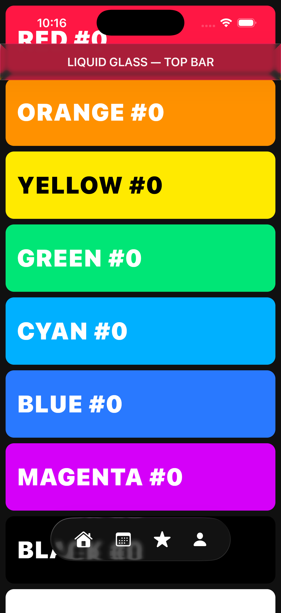

# Liquid Glass tab bar

On iOS the only native UI is the root tab bar: a SwiftUI `TabView`, which renders the Liquid Glass design as system chrome on iOS 26. Every screen behind it is drawn by Compose Multiplatform. Navigation logic (the back stack) is owned by Navigation3 on every platform, and iOS mirrors the tab-related part of that state into the native bar.

The bar comes from `TabView` itself, not from a hand-built `.glassEffect` surface, so it keeps the system appearance, accessibility behavior, and future OS refinements without reimplementation.

## Overlay embedding

`TabView` is chrome only. It is layered above the full-screen `ComposeUIViewController` with transparent tab content, so the single Navigation3 back stack keeps owning every screen and all tab switching:

```swift
ZStack {
    KaigiAppView()        // full-screen ComposeUIViewController, ignoresSafeArea
    RootTabView()         // TabView with transparent tab content; only the bar is visible
}
```

This shape places two requirements on the host:

- Touches inside the transparent tab content must pass through to the Compose layer beneath the `TabView`.
- The tab bar height must reach Compose as a bottom content inset: the Compose view controller is a sibling of the `TabView`, not a child of a tab, so it does not inherit the inset.

Scroll-driven bar behaviors (`tabBarMinimizeBehavior`, scroll-edge reactions) are driven by a native `UIScrollView` inside the tab content; Compose scrolling is invisible to UIKit, so the bar stays fully visible. The glass itself still refracts and tints the scrolling Compose content behind it.

## State bridge

`RootTab` and `RootTabNavigator` (`:app-shared`, free of UI types) form the model both sides share:

- **Kotlin → Swift**: `currentTab: StateFlow<RootTab?>` drives the `TabView` selection; `null` (a non-tab entry on top, that is, a detail screen) hides the bar.
- **Swift → Kotlin**: tab taps call `select(tab)`; `IosTabBarSyncEffect` (inside `KaigiApp`) turns each selection into `AppNavigator.moveToTop(tab.key)` — the same command the Compose bar issues on the other platforms.

`RootTabSceneDecorator` (the Compose bottom bar) is not applied on iOS; the native bar replaces it. For the tab-switching semantics, see [Root tab bar](./navigation-root-tab-bar.md).

## Cross-renderer compositing

The Liquid Glass bar refracts and tints the CMP (Skia/Metal) backdrop behind it: the glass samples the live Compose Metal layer, so as content scrolls the glass tracks the CMP colors underneath. The native `TabView` bar relies on this compositing, which requires iOS 26.



The screenshot shows a hand-built `.glassEffect` host over colorful scroll content, demonstrating the compositing the `TabView` bar relies on. The top bar picks up the red card behind it and is tinted red, while the bottom floating tab capsule refracts the text behind it through glass. Captured on the iOS 26.2 simulator in light mode.

CMP requires `CADisableMinimumFrameDurationOnPhone=true` in `Info.plist`, or it aborts on launch at `PlistSanityCheck`.

## Alternative: one Compose instance per tab

An alternative embedding gives each tab of the `TabView` its own `ComposeUIViewController` as real content instead of the transparent overlay. It buys native tab-switch transitions and automatic safe-area propagation, and requires:

- **Per-tab back stacks.** The single `NavBackStack` splits into one stack per tab. `AppNavigator.moveToTop` reordering — the cross-platform tab-switch model — no longer applies on iOS, and navigator commands must route to the selected tab's stack.
- **Per-tab state plumbing.** Back-stack persistence, `RetainNavEntryDecorator` scopes, and the snackbar and overlay hosts multiply per stack, and back semantics diverge from the other platforms: back no longer falls through stashed tabs, so the [`RootSceneStrategy`](./navigation-predictive-back-tabs.md) model does not carry over.
- **Deep-link routing.** A deep link resolves to a tab first, then pushes onto that tab's stack.

Scroll-driven bar behaviors remain unavailable in this embedding too — the content inside each tab is still Compose, not a native `UIScrollView`. The overlay embedding is the default because it keeps the navigation model identical across platforms and requires no change to the shared navigation code.

Related: [iOS overview](./ios.md) · [Root tab bar](./navigation-root-tab-bar.md) · [Navigation](./navigation.md)
