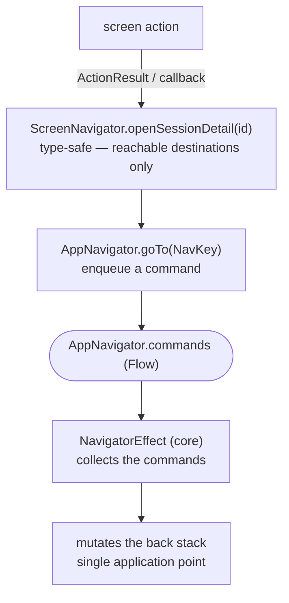

# Navigator

Editing `KaigiApp`'s `NavDisplay` by hand for every screen change risks breaking navigation and causes merge conflicts. So each feature registers its `NavEntry` through an interface that **Metro aggregates automatically** — `KaigiApp` is never touched. That isolation removes a feature's direct handle on the back stack (it used to be a passed-in lambda), so navigation is **abstracted through a Navigator**: a feature emits a command over a Flow, applied to the back stack in exactly one place.

## The flow

A navigation request travels this path end to end — from a screen action to the single point that mutates the back stack:



## AppNavigator + NavigatorEffect (core)

`AppNavigator` and `NavigatorEffect` are the primitive navigation mechanism, handling `NavCommand`s (`Push` / `Pop`): `AppNavigator` emits them, and `NavigatorEffect` applies them to the back stack.

```kotlin
sealed interface NavCommand {
    data class Push(val key: NavKey) : NavCommand
    data object Pop : NavCommand
}

@Inject
@SingleIn(UiScope::class)
class AppNavigator {
    private val commandChannel = Channel<NavCommand>(Channel.BUFFERED)
    val commands: Flow<NavCommand> = commandChannel.receiveAsFlow()
    fun goTo(key: NavKey) { commandChannel.trySend(NavCommand.Push(key)) }
    fun back() { commandChannel.trySend(NavCommand.Pop) }
}

@Composable
fun NavigatorEffect(navigator: AppNavigator, backStack: NavBackStack<NavKey>) {
    LaunchedEffect(navigator, backStack) {
        navigator.commands.collect { command ->
            when (command) {
                is NavCommand.Push -> backStack.add(command.key)
                NavCommand.Pop -> if (backStack.size > 1) backStack.removeLastOrNull()
            }
        }
    }
}
```
## Implementing a screen-level Navigator

`<Feature>ScreenNavigator` is a feature-owned interface that exposes the screen's outgoing navigations as type-safe methods (`openSessionDetail(id)`) — no `NavKey`, no back stack. Its `Default…` implementation is injected from **app-shared** (the one module that sees every feature); for in-app navigation, it maps each call to a concrete `NavKey` and pushes it via `AppNavigator`:

```kotlin
// feature:sessions — the intent, type-safe and NavKey-free
interface TimetableScreenNavigator {
    fun openSessionDetail(id: TimetableItemId)
}

// app-shared — sees every NavKey; @SingleIn the screen's scope, not UiScope
@Inject
@SingleIn(TimetableScreenScope::class)
@ContributesBinding(TimetableScreenScope::class)
class DefaultTimetableScreenNavigator(private val appNavigator: AppNavigator) : TimetableScreenNavigator {
    override fun openSessionDetail(id: TimetableItemId) = appNavigator.goTo(TimetableItemDetailNavKey(id))
}
```

The `ScreenRoot` consumes it as a plain lambda — it never holds the navigator or a `NavKey`, so it stays trivially testable:

```kotlin
// NavEntry registration (feature): the Root gets navigation as a plain lambda. The debounce is
// applied later, in the UI layer, at the interaction point (see Safe click below).
TimetableScreenRoot(
    onNavigateToDetail = { id: TimetableItemId -> graph.screenNavigator.openSessionDetail(id) },
)
```

Because the binding is `@SingleIn` the screen's scope, resolving the navigator from the app or UI graph is a Metro compile error — the DI graph confines it to the NavEntry layer, stronger than a checker or convention. (Only `AppNavigator.back()` stays UI-scoped.)

`graph` is the per-screen graph the NavEntry retains — see [NavEntry aggregation](./navigation-entry-aggregation.md) for how entries are registered and aggregated.

## External links

A destination outside the app — a sponsor's site, a contributor's profile — has no `NavKey` and never enters the back stack, so it does not belong to a `<Feature>ScreenNavigator`. The NavEntry supplies Compose's `LocalUriHandler` as the Root's navigation lambda instead, and the Root passes it on like any other:

```kotlin
entry<SponsorsNavKey> {
    val graph = retain(screenGraphFactory::createSponsorsScreenGraph)
    val uriHandler = LocalUriHandler.current
    context(graph.screenContext) {
        SponsorsScreenRoot(
            onNavigateBack = appNavigator::back,
            onNavigateToSponsorSite = uriHandler::openUri,
        )
    }
}
```

The Root and the Screen cannot tell the two apart: both receive an `on*` lambda, and `NavLambdaMustFlowToSafeClick` debounces an external link exactly as it debounces a push. A screen whose only outgoing navigation is external therefore declares no navigator methods.

## Safe click (navigation debounce)

A fast double-tap on a navigation button would fire the lambda twice: the first tap pushes (or pops) before the screen leaves composition, and the second repeats it — a duplicate detail push, or an over-pop that skips a screen. The defense is split across three layers, each owning a distinct concern:

1. **UI debounce — at the interaction point.** The debounce belongs where the user actually taps, not in the NavEntry wiring, so it is applied inside the screen. `SafeClickInvoker` (`:core:common`) is a **leading-edge throttle**: the first call in a quiet window runs immediately, and any further call within `interval` (default 500 ms) of the last accepted one is dropped. Its `TimeSource` is injectable, so it is unit-tested against a `TestTimeSource` with no wall-clock sleeps. Two `:core:ui` primitives read the ambient invoker:
   - `Modifier.safeClickable { … }` — a `Modifier.clickable` that gates `onClick` through the invoker; use it for any clickable that can drive navigation.
   - `safeClick { … }` / `safeClick(callback)` — wraps a callback for a library component that takes an `onClick` lambda, e.g. `Button(onClick = safeClick { … })`.
2. **NavigatorEffect — state-based backstop.** The single point that applies commands to the back stack keeps its `size > 1` guard so an over-pop can never crash below the root. This is the last-resort backstop if a double-fire ever slips past the UI debounce.
3. **Checker coverage — the flow is verified.** A conservative FIR checker proves every navigation-bound lambda actually reaches a `safeClick` sink (below).

### Wiring

- `rememberSafeClickInvokerNavEntryDecorator()` remembers one invoker per `NavEntry` and provides it through `LocalSafeClickInvoker` (same pattern as `rememberSnackbarNavEntryDecorator`); it is installed in `KaigiApp`'s `entryDecorators`. Outside any entry, `LocalSafeClickInvoker` falls back to a shared default instance.
- The NavEntry wiring now hands screens **plain** navigation lambdas. Each screen applies the debounce at the interaction point via `safeClickable` / `safeClick`.

```kotlin
// In the row component (interaction point), the tap is debounced:
Card(modifier = Modifier.safeClickable(onClick = onClick)) { /* … */ }
// A library component takes a wrapped callback:
Button(onClick = safeClick(onBack)) { Text("Back") }
```

System / predictive back is **not** debounced: `KaigiApp` binds the platform back gesture straight to the navigator (`onBack = appNavigator::back`). Repeated back gestures are the user asking to pop multiple screens — legitimate intent, unlike an accidental double tap on one button — and the `Pop` command is already guarded against emptying the stack. Programmatic navigation likewise flows straight through `NavigatorEffect`.

This is enforced by the **`NavLambdaMustFlowToSafeClick`** FIR checker (see [enforcement](./enforcement.md)). For every `@Composable` `*Screen` / `*ScreenRoot` in a feature package, each function-typed value parameter named `on[A-Z]*` may only be used as: an argument to `safeClick(…)` / `Modifier.safeClickable`'s `onClick`; forwarded into another in-module feature `@Composable`'s `on*` parameter (that declaration is checked by the same rule); invoked inside a lambda passed to `safeClick` / `safeClickable`; invoked inside a lambda that is itself passed to another in-module feature `@Composable`'s `on*` parameter; or invoked inside an `ActionResultEffect` lambda (the result-mediated path, whose originating tap is itself a `safeClickable` already forced by this checker). Anything else — a direct invocation in composition, or passing the lambda into a library click like `Button(onClick = param)` — is a compile error telling you to wrap it.

### Limits

The checker is deliberately conservative and works on names, not on whether a callback truly navigates: every `on*` parameter (bookmark toggles, day tabs, "clear data") must flow through a `safeClick` sink, even ones that only send a channel action. Callbacks stored in state or passed to a library sink are errors purely by that conservatism, and the fix is always the same: wrap with `safeClick`. Forwarding into a non-`*Screen` feature helper composable (for example a private `TimetableCard`) is trusted rather than recursively verified, so the helper is expected to apply the debounce at its own interaction point.

Related: [NavEntry aggregation (NavEntryProvider)](./navigation-entry-aggregation.md) · [NavKey serializer aggregation (NavKeySerializersProvider)](./navigation-navkey-serializers.md) · [enforcement](./enforcement.md)
