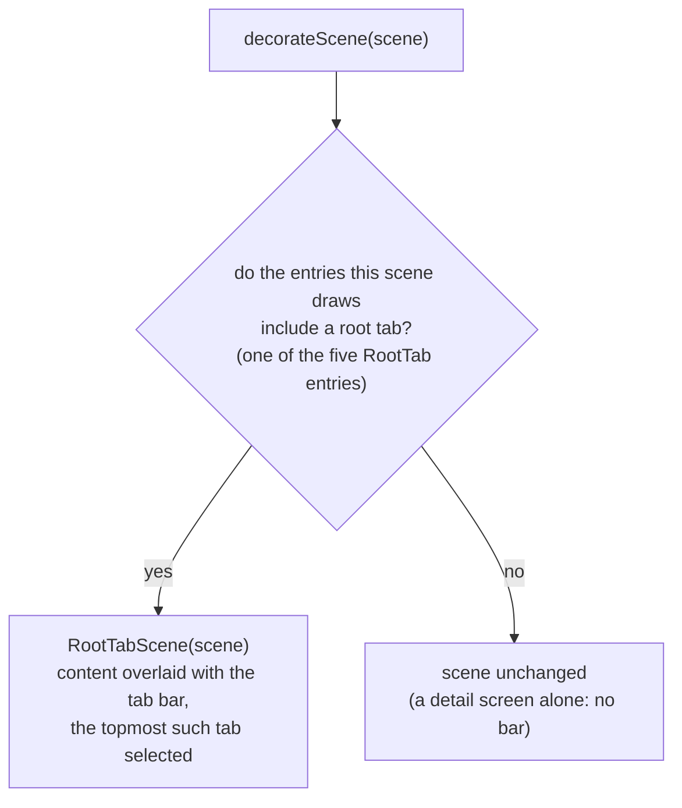

# Root tab bar (RootTabSceneDecorator)

The bottom navigation bar is added by a Nav3 `SceneDecoratorStrategy` — `RootTabSceneDecorator`, in `:app-shared` — passed to `NavDisplay(sceneDecoratorStrategies = listOfNotNull(rememberRootTabSceneDecorator(…)))`. The list tolerates a null because `rememberRootTabSceneDecorator` returns `null` on iOS, where the bar is native.

## How it is built

`decorateScene` asks which root tab the scene shows: the topmost entry it draws that names one of the five root tabs (`Timetable` / `EventMap` / `Favorites` / `About` / `ProfileCard`, declared by the `RootTab` enum). On a match it returns a scene that overlays the bar on the delegate's content; otherwise it returns the scene **unchanged** — so a detail screen shown on its own has no bar.

A scene that draws more than one entry — a [list-detail](./navigation-list-detail.md) scene on an expanded window — keeps its list pane on screen beside the detail above it. That list pane is a root destination, so the bar stays with its tab selected and another tab remains one tap away; the same detail reached on a compact window is a scene of one entry, matches no root tab, and has no bar.

The wrapper `RootTabScene` overrides `content` — a `Box` holding `delegate.content()` and a bottom-aligned `KaigiNavigationBar` from `:core:ui` — plus `equals` / `hashCode`, so a scene is reused only while the delegate and the selected tab both hold. Everything else delegates to the decorated scene, so the bar changes no navigation semantics.

The bar floats: it takes no layout space, so a scrollable root destination adds `KaigiNavigationBarDefaults.occupiedHeight` to its bottom content padding to clear it.

> `NavEntry.key` is private in Nav3, so the decorator cannot read the keys out of `Scene.entries`. It takes the back stack and reads `Scene.entries.size` instead: every scene this app forms draws the topmost entries of the stack, so the count names which keys are on screen.

## Tab switching

Tab taps are propagated out of the decorator as events; `KaigiApp` turns them into a single `AppNavigator.moveToTop(tab.key)` command, so the back stack is still mutated only in `NavigatorEffect`. `MoveToTop` **reorders instead of popping** — the deselected tab stays stashed on the stack, keeping its retained state across switches:

- selecting **About** from `[Timetable]` pushes it: `[Timetable, About]`;
- selecting **Timetable** again reorders: `[About, Timetable]` — About survives underneath;
- selecting **About** again: `[Timetable, About]`, with About's state intact.

The selected item reflects the topmost root the current scene shows. Back falls out of the single stack via `NavDisplay`'s `onBack`: it reaches whichever root is stashed directly beneath the top one; from the home root it exits, even with a tab stashed beneath it, because [`RootSceneStrategy`](./navigation-predictive-back-tabs.md) empties its `previousEntries`.

## iOS

On iOS the bar is native: `RootTabBarView`, a `UITabBar` overlaid on the Compose view controller, and `RootTabSceneDecorator` is not applied. Tab taps arrive through `RootTabNavigator` and land in the same `AppNavigator.moveToTop` path, so the back-stack semantics above hold unchanged. For details, see [Liquid Glass tab bar](./ios-liquid-glass.md).

Related: [Root NavEntry emulation (RootSceneStrategy)](./navigation-predictive-back-tabs.md) · [Architecture overview](./architecture-overview.md) · [Entry retention (RetainNavEntryDecorator)](./navigation-retain-entry-decorator.md)
