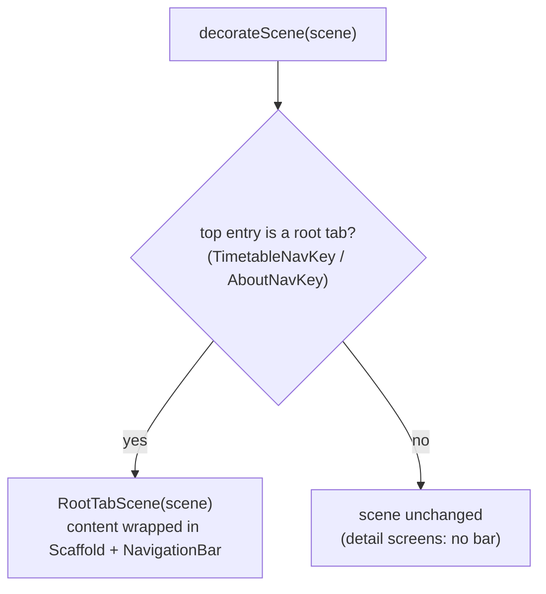

# Root tab bar (RootTabSceneDecorator)

The bottom navigation bar is added by a Nav3 `SceneDecoratorStrategy` — `RootTabSceneDecorator`, in `:app-shared` — passed to `NavDisplay(sceneDecoratorStrategies = listOf(rootTabSceneDecorator))`.

## How it is built

`decorateScene` reads the back stack's top entry; if it is a root tab (`TimetableNavKey` / `AboutNavKey`) it returns a scene whose content wraps the delegate in `Scaffold(bottomBar = NavigationBar { … })`, otherwise it returns the scene **unchanged** — so detail screens have no bar.

The wrapper `RootTabScene` overrides only `content` and delegates everything else to the decorated scene — it adds the bar and changes no navigation semantics.

> `NavEntry.key` is private in Nav3, so the decorator reads the typed key off the captured back stack (`backStack.lastOrNull()`) instead of the scene entries.

## Tab switching

Tab taps are propagated out of the decorator as events; `KaigiApp` turns them into a single `AppNavigator.moveToTop(tab.key)` command, so the back stack is still mutated only in `NavigatorEffect`. `MoveToTop` **reorders instead of popping** — the deselected tab stays stashed on the stack, keeping its retained state across switches:

- selecting **About** from `[Timetable]` pushes it: `[Timetable, About]`;
- selecting **Timetable** again reorders: `[About, Timetable]` — About survives underneath;
- selecting **About** again: `[Timetable, About]`, with About's state intact.

The selected item reflects whichever root is on top. Back falls out of the single stack via `NavDisplay`'s `onBack`: from About → Timetable; from the home root → exit, even with a tab stashed beneath it, because [`RootSceneStrategy`](./navigation-predictive-back-tabs.md) empties its `previousEntries`.

## iOS

On iOS the bar is native: a SwiftUI `TabView` overlays the Compose content and `RootTabSceneDecorator` is not applied. Tab taps arrive through `RootTabNavigator` and land in the same `AppNavigator.moveToTop` path, so the back-stack semantics above hold unchanged. For details, see [Liquid Glass tab bar](./ios-liquid-glass.md).

Related: [Root NavEntry emulation (RootSceneStrategy)](./navigation-predictive-back-tabs.md) · [Architecture overview](./architecture-overview.md) · [Entry retention (RetainNavEntryDecorator)](./navigation-retain-entry-decorator.md)
